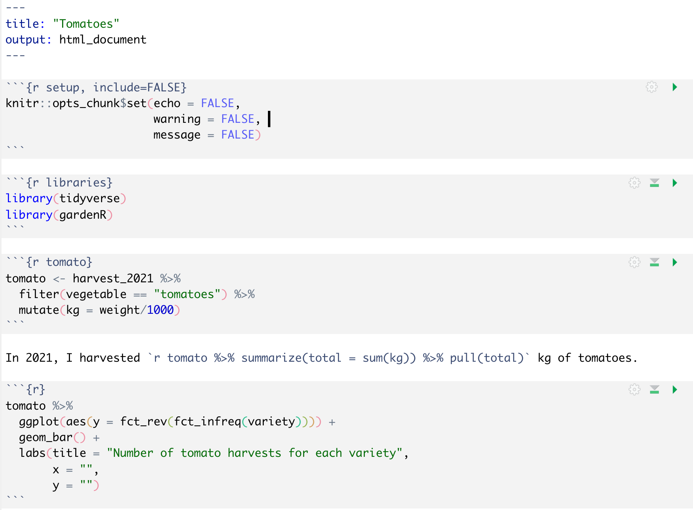

## Let's step back in time ...

```{r setup, include=FALSE}
knitr::opts_chunk$set(echo = TRUE, message = FALSE, warning = FALSE)
```

```{r, echo=FALSE}
library(tidyverse)
library(gardenR)
library(knitr)
library(here)
here::i_am("README.md")
```

<center>

{width="90%"}

</center>

<div class="notes">
Back before RMarkdown, like when I wrote my PhD thesis, my workflow looked something like this:

1. Write R code in something like notepad - pretty much just plain text, what you see in the lower left corner, with a section of code highlighted. 
2. Save any important output and images to folders that were "organized" by topic. This would include the plot you see on the right and could have also included some code output from the console.   
3. Make a note in the code file of what I named the images.  
4. Put this all together in a latex or Word document.  
5. Hope that I wouldn't forget what or where everything was.


</div>


---

<iframe src="https://giphy.com/embed/NTur7XlVDUdqM" width="480" height="270" frameBorder="0" class="giphy-embed" allowFullScreen></iframe><p><a href="https://giphy.com/gifs/trump-consequences-NTur7XlVDUdqM">via GIPHY</a></p>

<div class="notes">

It WAS NOT fine!  

I somehow put together my thesis in one document, but (don't tell anyone), there's no way I'd be able to put it all back together now! 

</div>

## Enter RMarkdown

<div class="columns-2">

{width="100%"}

See tomato_example.Rmd

{width="100%"}

</div>


<div class="notes">
Then came RMarkdown (introduced in 2012, just after I finished my thesis.)

Now I 

1. Write code to do analysis in an R Markdown file (includes all code, text, and output in one place) and compile to desired format, usually html.
2. If a change needs to be made, I can easily do that without having to figure out which piece of code created which output.  

This has made my life sooooo much easier!! It would be very difficult to going back to doing things the "old way" ... I haven't yet. And I continue to look for ways that RMarkdown might be able to make my life easier.

</div>

---

<center>

{width="80%"}

</center>

<div class="notes">

Next, I'd like to redirect you to the photo of my garden. I joke that it's my 3rd child in the summers. I'm sure you're wondering, what does Lisa's garden have to do with parameterized reports? 

Well, not only do I harvest fruit and vegetables from it, but I collect data, too!

Sooooo .... 

</div>

## Goal

Create a report for each vegetable that 

- Highlights how its weight compares to other vegetables.  
- Shows weights of different varieties of that vegetable.  
- Graphs cumulative harvest for that vegetable over time. 

Let's look at the report I created for tomatoes: 01_simple_report.html 


<div class="notes">
As a simple example, let's say I want to create a report for each vegetable that 

- Highlights how its weight compares to other vegetables.  
- Shows weights of different varieties of that vegetable.  
- Graphs cumulative harvest for that vegetable over time. 

Let's look at the report I created for tomatoes: 01_simple_report.html 

</div>

---

<center>

<video width="800" height="600" controls>
  <source src="images/simple_report.mp4" type="video/mp4">
</video>

</center>

<div class="notes">
PLAY VIDEO. You can see we have all the features in the report we desired.
</div>


---

<center>

<video width="800" height="600" controls>
  <source src="images/tomatoes.mp4" type="video/mp4">
</video>

</center>

<div class="notes">
PLAY VIDEO. Now we'll scroll through the code that created the report. I've highlighted all the places the word "tomatoes" is used in the code. If I want to create the same report for a different vegetable, I certainly don't want to have to manually manually change all those words! 
</div>


## Now what? ... `params`!

See 02_parameterized_report.Rmd for code and the .html file for the report.

{width="70%"}


<div class="notes">
As I just mentioned, trying to replicate this new report using find and replace would be awful. We could set up a variable at the beginning of the code, which would solve many (although not all) of our problems, but that won't give us a good way to programatically run the file, which I'll talk about later. 

Instead, we add something new to the YAML header: a parameter. The parameter is vegetable, and its initial value is "tomatoes". 
</div>


---

<center>

<video width="800" height="600" controls>
  <source src="images/using_params.mp4" type="video/mp4">
</video>

</center>

<div class="notes">
PLAY VIDEO:

Once I run a section of code, the parameter is accessible via params, dollar sign, name of parameter. So, `params$vegetable`, which in this case results in "tomatoes". I can then use `params$vegetable` throughout the code. I will point out a few examples.

- Here I use it to create a variable that will be used to color the tomatoes differently in a bar graph and in a table.  
- Here I use it to add the word tomatoes to the section header.  
- As I'm scrolling through the code, you can see more `params$vegetable`s.
- Here I use it to put the word tomatoes in a ggplot title. 

</div>

---

What you type in Rmd:

{width="100%"}

\
\

What it looks like in knitted file:
{width="100%"}

<div class="notes">
Here are a few examples of what those look like when the file is knitted. Here's the title in the YAML section. 
</div>

---

```{r, eval=FALSE}
  mutate(veggie_color = vegetable == params$vegetable) %>% 
  ggplot(
    aes(x = total_weight_kg,
        y = fct_reorder(vegetable, total_weight_kg),
        fill = veggie_color)
  )
```

{width="100%"}

<div class="notes">
The tomatoes bar being highlighted in a different color in the barplot. 
</div>
---

```{r, eval=FALSE}
labs(title = paste0("Total  harvest of each variety (kg), 2021: ", params$vegetable)
```

{width="100%"}

<div class="notes">
And the ggplot title containing the word tomatoes. 
</div>

## I want the lettuce report!

<center>
<video width="800" height="500" controls>
  <source src="images/param_change_rmd.mp4" type="video/mp4">
</video>
</center>

<div class="notes">
I can go into the rmd file and manually change the param to the value I want to create the new report. Or ....
</div>

## Change the parameter value - programmatically

See 03_render_reports.R

```{r, eval=FALSE}
render(
  # Point to the Rmd file
  input = here("02_parameterized_report.Rmd"),
  # Name the output file (and path)
  # This code puts it in a folder called sample_render
  output_file = here("sample_render", "lettuce_example.html"),
  # New value of parameter
  params = list(vegetable = "lettuce")
  )
```

<div class="notes">
I can use the `render()` function to change it programatically!

The render function has three arguments

- the first is input which gives the path and file name of the parameterized report file.  
- output_file gives the path and name of the output file.  
- and params gives the value for the parameter in a list, with the name of the parameter, equals sign, and new value of the parameter. 

If there was more than one parameter, they would be separated by commas in the params argument list. 
</div>

## Making a lot of reports

```{r, eval=FALSE}
# Vector of all vegetables with more than 2 harvests
veg <- harvest_2021 %>% 
  group_by(vegetable) %>% 
  summarize(n = n()) %>% 
  filter(n > 2) %>% 
  pull(vegetable)

# tibble that has the input Rmd, output file path, 
# and params written correctly as a list, eg. list(vegetable = "peppers") 
reports <- tibble(input = here("02_parameterized_report.Rmd"),
                  output_file = here("output", paste0(veg, "-report.html")),
                  params = map(veg, ~list(vegetable = .)))

# creates all the reports!
reports %>% pwalk(render)
```

<div class="notes">
This gives me the opportunity to write some more complex code that will create all the reports I want, with very little work on my end. 

The top set of code creates a vector of all vegetables with more than 2 harvests. 

The next set of code creates a tibble called reports. That tibble has a variable named input of the input parameterized report, a variable with all the output files, where the report name starts with the vegetable name, and a variable of the params in the list form it requires. So, each value of that params variable is actually a list (SEE NEXT SLIDE).  

Lastly, the pwalk function is used to apply the `render()` function to each row of the reports tibble, which will create the report for each vegetable of interest. 
</div>

---

{width="50%"}

## Other examples

- Urban Institute's [State Fiscal Briefs](https://www.urban.org/policy-centers/cross-center-initiatives/state-and-local-finance-initiative/projects/state-fiscal-briefs)  
- North Carolina's [postsecondary education attainment dashboard](https://dashboard.myfuturenc.org/county-data-and-resources/)  
- [Financial report](https://github.com/lindblb/pro_reports_talk/blob/main/finished_reports/fargo_2019_11.pdf) example from Brad Lindblad  
- [Real estate data](https://data.ocenime.bg/examples/comparable) (in Bulgarian)  
- [Tutorial](https://www.danieldsjoberg.com/dca-tutorial/dca-tutorial-r.html) by Daniel Sjoberg where coding language is a parameter  
- R for the Rest of Us's (David Keyes) Partnership for Strong Communities/Connecticut Data Collaborative [Housing Data Profiles](https://housingprofiles.pschousing.org/)

<div class="notes">
The example I gave was pretty simple, but there are many great use cases. When you have time, check these out. One of them is by David Keyes, who is speaking at this conference later today :)
</div>

## Getting started on your own

- R Markdown: The Definitive Guide, [Ch. 15 Parameterized reports](https://bookdown.org/yihui/rmarkdown/parameterized-reports.html)
- Urban Institute [tutorial](https://urban-institute.medium.com/iterated-fact-sheets-with-r-markdown-d685eb4eafce) with David Keyes' [video](https://rfortherestofus.com/2020/10/parameterized-reporting-with-rmarkdown/)  
- Taking it a step further and [creating an API](https://www.datalorax.com/post/power-parameterized-reports-plumber/) by the datalorax (Daniel Anderson)
- Parameterized reporting [using Quarto](https://www.mm218.dev/posts/2022-08-04-how-to-use-quarto-for-parameterized-reporting/) by Mike Mahoney. 

<div class="notes">
Since this was a really quick rundown, here are some resources you can check out to get started. Note that the last one is about using Quarto instead of RMarkdown. I haven't ventured down that path yet but hope to do it soon.
</div>


## Thank you!


The slides and other files I referenced on the slides are on my github page: https://github.com/llendway/parameterized_reporting_canssi

